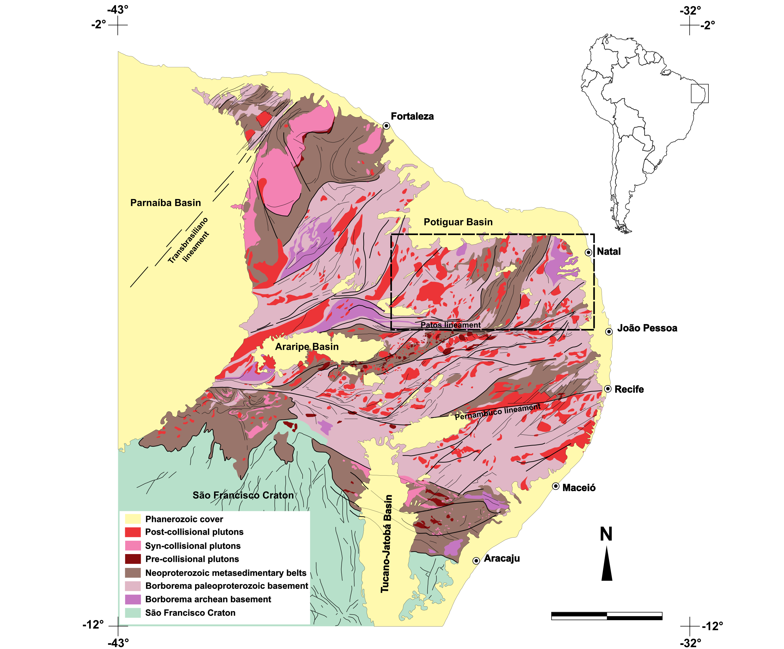
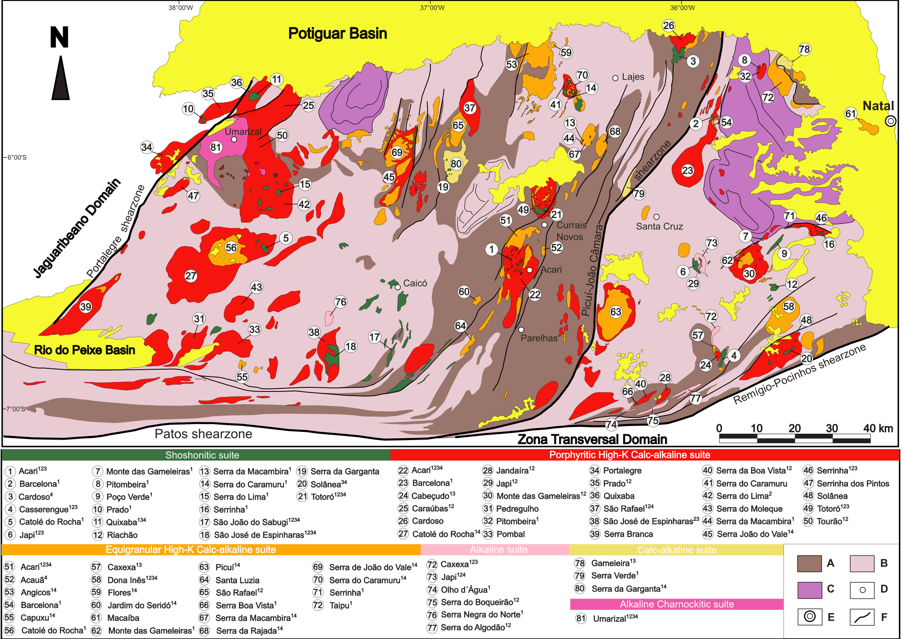
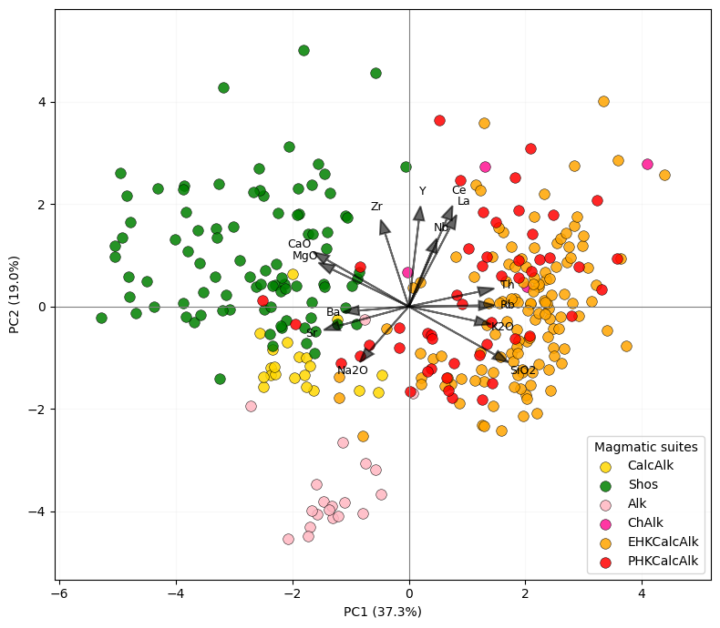
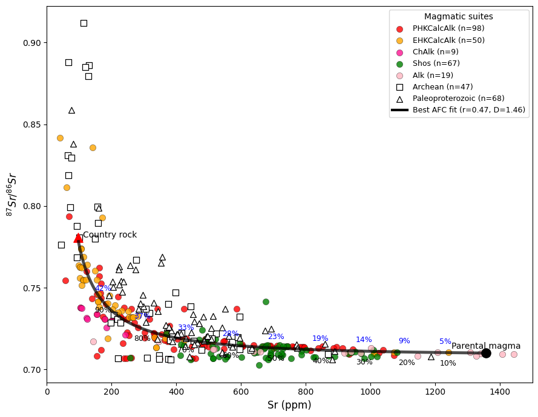
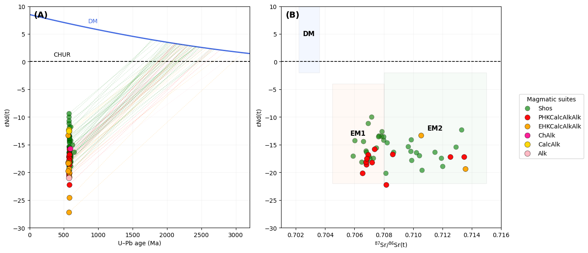
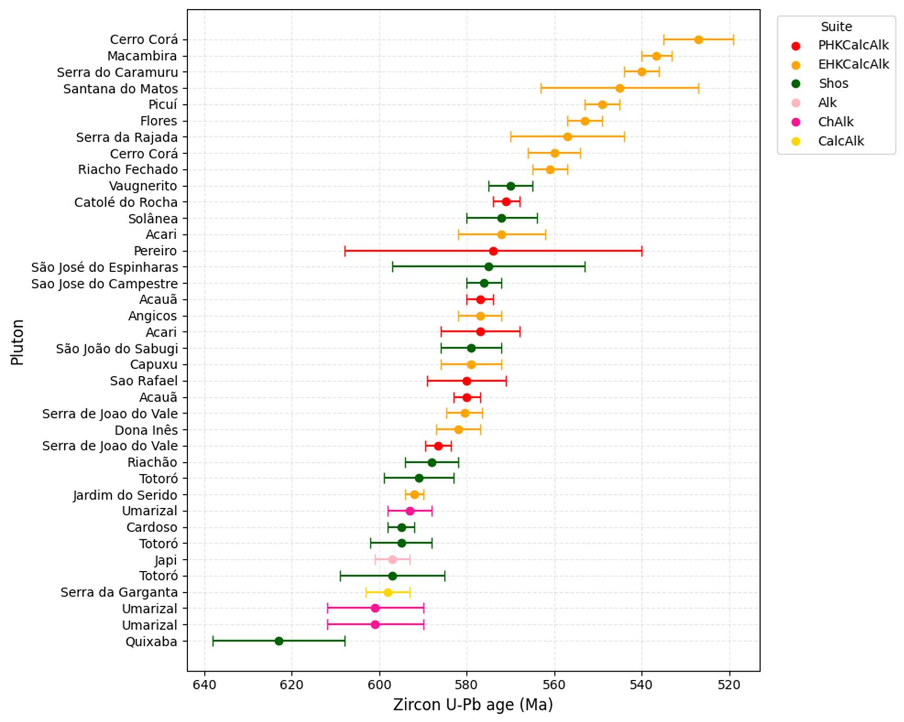
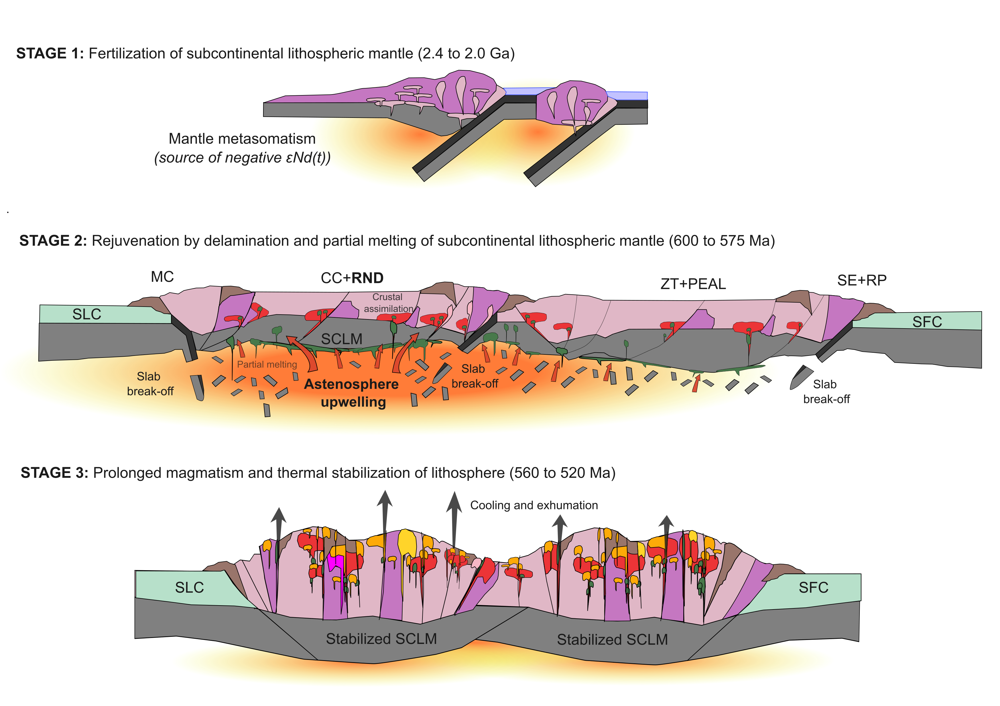

Vamos atualizar o readme:

# Borborema Magmatism Toolkit

[]()
[]()

Python toolkit for geochemical, isotopic, and geochronological analysis of post-collisional magmatic systems, developed for the study of Ediacaran–Cambrian granitoid magmatism in the Rio Grande do Norte Domain, Borborema Province (NE Brazil).

This toolkit supports integrated studies of:

- whole-rock geochemistry  
- radiogenic isotopes  
- zircon U–Pb geochronology  

---

## Reproducibility

All figures and results presented in this repository can be fully reproduced using the provided datasets and scripts.

---

# Conceptual basis

The codes apply classical igneous petrology models to quantify the processes of mantle partial melting, basement assimilation, and fractional crystallization. The classification into six magmatic suites adopted here is based on Nascimento et al. (2015) and represents the post-collisional magmatism of the Borborema Province, exposed in the crystalline basement of the Rio Grande do Norte Domain. These rocks record the final stages of West Gondwana assembly during the Ediacaran.

Assimilation–fractional crystallization (AFC) models after DePaolo (1981) are used to quantify the relative contributions of mantle melting and crustal assimilation, using natural compositions as proxies for primitive magma and assimilated crustal material.

εNd(t) versus age models are constructed using isotopic evolution curves for CHUR (Jacobsen and Wasserburg, 1980) and the depleted mantle (DM) following DePaolo (1984). Compositional fields for enriched mantle reservoirs (EM1 and EM2) are based on the global mantle component framework of Zindler and Hart (1986).

---

# Geological context

## Borborema Province

The Borborema Province comprises a complex Neoproterozoic orogenic system structured by major shear zones, basement domains, supracrustal belts, and widespread granitoid plutonism. The Rio Grande do Norte Domain preserves one of the most expressive records of Ediacaran post-collisional magmatism.



*Figure 1. Regional geological framework of the Borborema Province. The dashed rectangle highlights the Rio Grande do Norte Domain.*

## Rio Grande do Norte Domain



*Figure 2. Geological map showing the distribution of post-collisional magmatic suites.*

---

# Overview

The toolkit integrates workflows commonly used in igneous petrology and isotope geochemistry:

- whole-rock PCA  
- AFC modelling  
- Sm–Nd isotopic modelling  
- zircon U–Pb geochronology  

---

# Requirements

Python 3.9+

```text
numpy
pandas
matplotlib
scikit-learn
scipy
```

Install dependencies:

```bash
pip install -r requirements.txt
pip install -e .
python run_all_figures.py

# Installation

git clone https://github.com/cataclase/borborema-magmatism-toolkit
cd borborema-magmatism-toolkit
pip install -r requirements.txt

# Quick start

python run_all_figures.py

# Repository structure

```
borborema-magmatism-toolkit/
├── README.md
├── requirements.txt
├── pyproject.toml
├── run_all_figures.py
│
├── examples/
│   └── Example_DRN.xlsx
│
├── figures/
│   ├── PCA.png
│   ├── AFC_SrSr.png
│   ├── SrNd.png
│   └── UPB_geochronology.png
│
└── borborema/
    ├── __init__.py
    ├── wr_pca.py
    ├── afc_model.py
    ├── sr_nd_models.py
    ├── upb_geochronology.py
    ├── datasets.py
    └── data_cleaning.py

---

# Installation

Clone the repository:

```
git clone https://github.com/cataclase/borborema-magmatism-toolkit
cd borborema-magmatism-toolkit
```

Install dependencies:

```
pip install -r requirements.txt
```

# Quick Start

Run all example workflows and reproduce the figures: 
python run_all_figures.py

---

# Whole-rock geochemistry – PCA

## Principal Component Analysis (PCA)

Principal Component Analysis (PCA) is used to identify geochemical trends and discriminate magmatic suites by reducing dataset dimensionality. The selected elements include major elements (e.g., CaO, Na2O, K2O), large-ion lithophile elements (e.g., Rb, Ba, Sr), and high-field strength elements (e.g., Zr, Nb, Ti), allowing the evaluation of magma differentiation, mantle source characteristics, and crustal assimilation. Together, these variables capture the combined effects of partial melting, fractional crystallization, and assimilation–fractional crystallization (AFC).



*Figure 3. Principal Component Analysis (PCA) of whole-rock geochemical data from the Rio Grande do Norte Domain. PC1 (37.3%) defines a differentiation axis from compatible-element-rich compositions (e.g., CaO) to incompatible-element-enriched magmas (e.g., Rb, Th, Nb), reflecting fractional crystallization and AFC processes. PC2 (19.0%) records secondary variations related to source heterogeneity and crustal interaction. Distinct clustering of magmatic suites highlights their petrogenetic relationships within a post-collisional setting.*

Example:

```python
import pandas as pd
from borborema.wr_pca import run_pca_from_dataframe

df = pd.read_csv("sample_data/wr_pca_exemple.csv", encoding="utf-8-sig")
df.columns = df.columns.str.replace("", "", regex=False)

variables = [
    "SiO2", "MgO", "CaO", "Na2O", "K2O",
    "Rb", "Ba", "Sr", "Nb", "Zr", "Y", "Th", "La", "Ce"
]

fig, results = run_pca_from_dataframe(
    df,
    variables=variables,
    series_col="Suite"
)

print("Explained variance:", results["explained_variance"])
print("Groups:", results["groups"])
```

---

# Rb–Sr isotope modelling – AFC

Assimilation–fractional crystallization (AFC) modelling follows the formulation of DePaolo (1981), in which magma evolution is controlled by the coupled effects of crystal fractionation and crustal assimilation. The parameter r represents the ratio between the rate of assimilation and the rate of fractional crystallization.

Model curves are generated by progressively removing melt (fractional crystallization) while simultaneously adding assimilated crustal material. The degree of evolution along each curve is expressed as F, the remaining melt fraction, where F decreases from 1 (parental magma) to lower values as crystallization proceeds.

The proportion of assimilated material increases as F decreases and is controlled by r, such that the total assimilated mass is proportional to r × (1 − F). Best-fit AFC trajectories are obtained by comparing model curves with natural isotopic compositions, allowing estimation of both the extent of crystallization and the relative contribution of crustal assimilation.

The AFC trajectories indicate that magma evolution was controlled by progressive fractional crystallization accompanied by significant crustal assimilation, with assimilation proportions increasing as melt fraction decreases.

*Initial compositions used in the AFC modelling are based on natural samples, including the most primitive shoshonitic composition as a proxy for the parental magma and a representative basement sample from the Caicó Complex as the assimilant. This approach ensures that model parameters are grounded in geologically realistic end-members. For reproducibility and broader application, users are encouraged to define their own initial compositions using primitive magmas and representative crustal lithologies from their study area, allowing the workflow to be adapted to different geological settings.*



*Figure 4. AFC modelling (DePaolo, 1981) for magmatic suites of the Rio Grande do Norte Domain. Curves represent theoretical evolution paths controlled by varying assimilation-to-crystallization ratios (r), illustrating the progressive interaction between mantle-derived magmas and crustal material. The distribution of samples along the AFC trajectories indicates variable degrees of crustal assimilation, with more evolved compositions plotting toward higher r values. These trends support a model of open-system magma evolution dominated by assimilation–fractional crystallization processes.*

Example:

```python
import pandas as pd
from borborema.afc_model import run_afc_from_dataframe

df = pd.read_csv("sample_data/afc_model_exemple.csv", encoding="latin1")

fig, results = run_afc_from_dataframe(
    df,
    Sr_m=1356,
    R_m=0.71008,
    Sr_c=96.8,
    R_c=0.7808,
    series_col="SERIE",
    iterations=10000,
    random_state=42
)

print("Best r:", results["best_r"])
print("Best D:", results["best_D"])
```

# Sm–Nd isotopic evolution

## Sm–Nd isotopic modelling

Sm–Nd isotopic modelling is used to evaluate mantle source characteristics and crustal contributions through time. εNd(t) values are calculated using CHUR (Jacobsen and Wasserburg, 1980) as a reference and compared with depleted mantle (DM) evolution curves following DePaolo (1984). Compositional fields for enriched mantle reservoirs (EM1 and EM2) are based on the global mantle component framework of Zindler and Hart (1986).

Positive εNd(t) values indicate derivation from depleted mantle sources with relatively short crustal residence times, whereas negative εNd(t) values reflect contributions from enriched sources, such as subcontinental lithospheric mantle or older continental crust. Increasingly negative εNd(t) values are therefore interpreted as evidence of crustal involvement and/or mantle source enrichment.

Depleted mantle (DM) signatures are typically associated with MORB-like sources, whereas enriched mantle signatures (EM1 and EM2) reflect mantle domains modified by recycled crustal materials. EM1 is commonly linked to older lithospheric mantle, while EM2 is frequently associated with sediment-influenced sources and is typical of continental and intraplate magmatism.

In the Rio Grande do Norte Domain, the predominantly negative εNd(t) values indicate that magmas were derived from an enriched subcontinental lithospheric mantle and/or interacted with ancient continental crust. εNd(t) versus age diagrams allow evaluation of source inheritance, while εNd(t) versus ⁸⁷Sr/⁸⁶Sr(t) plots provide a combined isotopic framework to discriminate between mantle and crustal contributions. The observed isotopic trends define a continuum between mantle-derived magmas and crustally contaminated compositions, consistent with open-system evolution dominated by assimilation–fractional crystallization (AFC).



*Figure 5. Sm–Nd isotopic systematics of magmatic suites from the Rio Grande do Norte Domain. (A) εNd(t) versus age diagram showing evolution relative to CHUR and depleted mantle (DM). Negative εNd(t) values indicate derivation from enriched lithospheric mantle and/or interaction with ancient continental crust. (B) εNd(t) versus ⁸⁷Sr/⁸⁶Sr(t) diagram highlighting the distribution of samples relative to depleted mantle (DM) and enriched mantle reservoirs (EM1–EM2). The isotopic signatures define a continuum between mantle-derived magmas and crustally contaminated compositions, consistent with open-system evolution dominated by assimilation–fractional crystallization (AFC).*

Example:

```python
import pandas as pd
from borborema.sr_nd_models import run_sr_nd_from_dataframe

df = pd.read_csv("sample_data/sr_nd_models_exemple.csv", encoding="latin1")

fig, results = run_sr_nd_from_dataframe(df)

print(results)
```

---

# U–Pb geochronology

Zircon U–Pb geochronology is used to constrain the timing and duration of magmatic activity in the Rio Grande do Norte Domain. Crystallization ages represent the timing of magma emplacement and provide a temporal framework for evaluating magmatic evolution across different suites.

The compiled dataset reveals a concentration of ages between ~600 and 520 Ma, defining a prolonged magmatic interval during the Ediacaran–Cambrian transition. This temporal distribution records the progressive evolution of post-collisional magmatism following the assembly of West Gondwana.

The prolonged duration of magmatism (~80 Ma) supports a model of sustained lithospheric thermal reworking, rather than short-lived magmatic pulses, consistent with progressive mantle–crust interaction and AFC-driven evolution.



*Figure 6. Compilation of zircon U–Pb crystallization ages for magmatic suites of the Rio Grande do Norte Domain. Data are grouped by pluton and magmatic suite, with error bars representing analytical uncertainties. The age distribution defines a prolonged magmatic interval between ~600 and 520 Ma, indicating sustained magmatic activity during the late stages of West Gondwana assembly. Overlap between suites suggests partially coeval magmatism and progressive evolution within a post-collisional setting.*

Example:

```python
import pandas as pd
from borborema.upb_geochronology import plot_upb_ages

df = pd.read_csv("sample_data/upb_geochronology_exemple.csv", encoding="utf-8-sig")

fig = plot_upb_ages(df)
```
## Integrated petrogenetic and geodynamic model

The combined geochemical, isotopic, geochronological, and multivariate datasets define a coherent model for the evolution of post-collisional magmatism in the Rio Grande do Norte Domain.

Sm–Nd isotopic signatures indicate that magmatism was sourced from an enriched subcontinental lithospheric mantle, previously metasomatized during Paleoproterozoic–Archean events. Consistently negative εNd(t) values, coupled with EM2-like signatures, point to a lithospheric mantle reservoir modified by ancient crustal components.

Zircon U–Pb ages constrain magmatism between ~600 and 520 Ma, defining a prolonged magmatic interval (~80 Ma) rather than discrete pulses. This temporal framework indicates sustained thermal input and progressive lithospheric reworking during the late stages of West Gondwana assembly.

Geochemical trends revealed by PCA define systematic variations from mantle-derived to increasingly evolved compositions, while AFC modelling quantifies the role of crustal assimilation during magma evolution. Together, these datasets indicate that mantle-derived magmas underwent progressive assimilation–fractional crystallization within the continental crust, producing the observed diversity of magmatic suites.

These results support a three-stage geodynamic model: (1) long-term fertilization of the subcontinental lithospheric mantle; (2) lithospheric rejuvenation driven by delamination and asthenospheric upwelling, triggering partial melting; and (3) prolonged magmatism leading to thermal stabilization and reorganization of the lithosphere.



*Figure 7. Conceptual model for the evolution of post-collisional magmatism in the Rio Grande do Norte Domain. (1) Paleoproterozoic–Archean fertilization of the subcontinental lithospheric mantle (SCLM) through mantle metasomatism, generating enriched isotopic signatures (negative εNd(t)). (2) Ediacaran lithospheric rejuvenation (~600–575 Ma) driven by delamination and slab break-off, promoting asthenospheric upwelling and partial melting of the enriched SCLM. Mantle-derived magmas ascend and evolve through assimilation–fractional crystallization (AFC) within the continental crust. (3) Prolonged magmatism (~560–520 Ma) leads to thermal stabilization and reorganization of the lithosphere, forming the present-day crustal architecture. This model integrates geochemical, isotopic, and geochronological constraints, highlighting the role of enriched lithospheric mantle sources and open-system magma evolution during the final stages of West Gondwana assembly.*

Overall, the Rio Grande do Norte Domain records a protracted history of mantle–crust interaction, in which enriched lithospheric mantle sources and open-system magma evolution played a key role in the generation of post-collisional granitoid magmatism.


# Reproducing all figures

All figures used in the examples can be generated automatically:

```
python run_all_figures.py
```

Figures will be saved in:

```
figures/
```

---

# Testing in Google Colab

You can test the toolkit in Google Colab by uploading the repository files and running the example workflows directly.

Example:

```python
import pandas as pd
import matplotlib.pyplot as plt
from borborema.sr_nd_models import run_sr_nd_from_dataframe

df = pd.read_csv("sample_data/sr_nd_models_exemple.csv", encoding="latin1")

fig, results = run_sr_nd_from_dataframe(df)

print(results)
plt.show()
```

To generate all example figures in Colab:

```python
%cd /content
!python -m borborema.run_all_figures
```

---

# Scientific context

The toolkit was developed to investigate:

• Post-collisional magmatism  
• Crust–mantle interaction  
• Magmatic differentiation processes  
• Isotopic evolution of granitoid systems  

The workflows implemented here were applied to magmatic suites of the Borborema Province.

---

# Code availability

All scripts used for geochemical modelling and figure generation are available in this repository.

---

# Author

Caio Tavares  
Mine Geologist | Igneous Petrology | Isotope Geochemistry

---
# How to Cite

If you use this toolkit in scientific work, please cite:

Tavares, C. (2026)  
Borborema Magmatism Toolkit: Python tools for geochemical and isotopic analysis of granitoid systems.  
GitHub repository.  
https://github.com/cataclase/borborema-magmatism-toolkit

---
# License

MIT License
